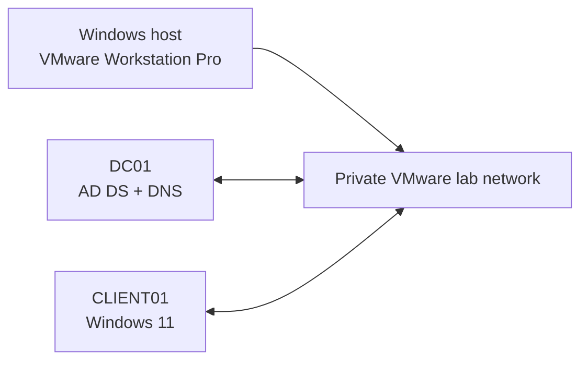

# Active Directory Domain Services Home Lab

## Project overview

This project documents the completed design and implementation of a virtualized Microsoft Active Directory Domain Services (AD DS) environment. The lab was built in VMware Workstation Pro to demonstrate practical skills in Windows Server administration, identity management, DNS, Group Policy, access control, troubleshooting, and technical documentation.

The environment represents a fictional company named **Northstar Technologies**. All names, addresses, users, and credentials used in the project are fictional.

> **Project status: Complete.** `DC01` is a healthy domain controller for `northstar.example.com`. `CLIENT01` is domain joined; identity and account-lifecycle administration, Group Policy processing, and IT/HR access through AGDLP have been validated. The domain password and account-lockout baseline is configured and protected by a GPO backup. The completed scope intentionally uses one domain controller.

## Project objectives

- Deploy Windows Server 2022 as a virtual machine.
- Configure a safe, isolated VMware lab network.
- Install AD DS and create a new forest.
- Configure integrated DNS services.
- Join a Windows 11 client to the domain.
- Design organizational units for users, groups, computers, and administrators.
- Create role-based security groups.
- Implement account provisioning and deprovisioning workflows.
- Apply and troubleshoot Group Policy Objects.
- Configure file-sharing and NTFS permissions.
- Document testing, failures, resolutions, and lessons learned.

## Lab environment

| System | Hostname | Role | Operating system |
|---|---|---|---|
| Domain controller | `DC01` | AD DS, DNS | Windows Server 2022 with Desktop Experience |
| Client workstation | `CLIENT01` | Domain-joined endpoint | Windows 11 Pro 25H2 |
| VMware host | Not documented publicly | Hypervisor host | Windows |

The lab uses the `northstar.example.com` forest on VMware NAT network `192.168.183.0/24`. `DC01` has static address `192.168.183.10`.

## Architecture

## Implementation roadmap

| Phase | Deliverable | Status |
|---:|---|---|
| 0 | Prerequisite assessment and recovery snapshot | Complete |
| 1 | Windows Server VM deployment | Complete |
| 2 | VMware networking and static addressing | Complete |
| 3 | AD DS installation and forest creation | Complete |
| 4 | Client domain join and first user login | Complete |
| 5 | OU, user, computer, and group administration | Complete |
| 6 | Group Policy configuration | Complete - user restriction validated and rolled back |
| 7 | File shares and access control | Complete - IT Modify and HR Read validated |
| 8 | Domain password and account-lockout policy | Complete - baseline configured and GPO backed up |

## Complete lab coverage

### 1. Planning, virtualization, and recovery

- Assessed host CPU, memory, and storage before allocating VM resources.
- Created `DC01` with 2 vCPUs, 4 GB RAM, and a 60 GB virtual disk.
- Installed Windows Server 2022 Standard Evaluation with Desktop Experience.
- Installed VMware Tools and verified service status, storage, memory, and Secure Boot.
- Used powered-off VMware snapshots as recovery checkpoints before major changes.
- Distinguished a hypervisor snapshot from a proper server, directory, or GPO backup.

### 2. Server preparation and networking

- Renamed the server to `DC01` and validated the change after restart.
- Used VMware NAT on `192.168.183.0/24` with gateway `192.168.183.2`.
- Assigned `DC01` the static address `192.168.183.10/24`.
- Reviewed DHCP scopes, leased addresses, default gateways, DNS settings, and connectivity.
- Corrected the Windows network profile from `Public` to `DomainAuthenticated` after domain discovery succeeded.
- Verified time-zone and Windows Time configuration because Kerberos authentication depends on synchronized time.

### 3. AD DS forest, domain, and DNS deployment

- Installed the AD DS role and its required management tools.
- Promoted `DC01` into a new forest named `northstar.example.com` with NetBIOS name `NORTHSTAR`.
- Selected Windows Server 2016 forest and domain functional levels supported by the lab.
- Installed DNS during promotion and intentionally left DNS delegation unchecked for the new isolated forest.
- Explained the DSRM password, Global Catalog, SYSVOL, NTDS database, and DNS delegation warning.
- Validated the domain, AD-integrated forward zones, host records, LDAP SRV records, and DC Locator results.
- Explained why domain members must use the AD DNS server rather than a public DNS resolver.

### 4. Client domain join and computer-account lifecycle

- Verified that Windows 11 Pro supports an AD DS domain join.
- Renamed the workstation to `CLIENT01` and configured `DC01` as its preferred DNS server.
- Joined and authenticated `CLIENT01` to `northstar.example.com`.
- Confirmed the computer object in Active Directory Users and Computers and verified the secure channel.
- Compared local accounts with domain accounts and retained a local administrative recovery account.
- Practised removing the client from the domain, identifying and deleting a stale computer object, and signing in locally.
- Created a Workstations OU, manually prestaged `CLIENT01`, and rejoined the physical VM to the prestaged identity.
- Explained that creating a computer object manually does not itself join a computer to the domain.

### 5. Organizational units and identity administration

- Built the `NorthStar` OU structure for Users, Workstations, and Groups.
- Created domain users and tested their authentication on `CLIENT01`.
- Practised password resets, disabling and re-enabling users, and validating the resulting sign-in behavior.
- Distinguished authentication (proving identity) from authorization (receiving permitted access).
- Explained that OUs organize and delegate administration, while security groups assign permissions.

### 6. Security groups, SIDs, and AGDLP

- Created role-based global groups such as `GG_IT_Users` and `GG_HR_Users`.
- Created resource-based domain local groups such as `DL_IT_Share_Modify` and `DL_HR_Share_Read`.
- Nested accounts and groups using the AGDLP model: Accounts → Global groups → Domain Local groups → Permissions.
- Explained group scope, group membership, and why permissions should normally be assigned to groups instead of individual users.
- Explained that Windows ACLs reference a security principal's SID rather than its display name.
- Documented that renaming or moving the same group does not change its SID, while deleting and recreating it produces a new SID.
- Reviewed how group membership SIDs enter a user's access token at sign-in and why a fresh sign-in may be needed after membership changes.

### 7. Group Policy administration

- Explained what a GPO is, its purpose, and how computer and user settings are processed.
- Created, linked, scoped, refreshed, tested, and removed a user GPO.
- Applied a Control Panel restriction to a user OU, validated the restriction on `CLIENT01`, and rolled it back safely.
- Practised an additional wallpaper GPO and reviewed applying policy to an OU or a single user through OU placement or security filtering.
- Used `gpupdate /force` for immediate refresh and reviewed Group Policy Results for effective-policy validation.
- Investigated an RPC/WMI error encountered while remotely querying Group Policy Results.
- Distinguished creating a GPO from linking it and explained inheritance, link scope, and security filtering.

### 8. File sharing and authorization

- Created departmental SMB shares at `C:\shares\IT` and `C:\shares\HR`.
- Compared share permissions with NTFS permissions and applied least-privilege access.
- Granted IT Modify access and HR Read access through domain local security groups.
- Retained administrative and SYSTEM Full Control entries.
- Configured access-based enumeration, disabled offline caching, and enabled SMB data encryption for the lab shares.
- Tested positive access by creating, editing, and renaming a file as an authorized user.
- Tested negative access and confirmed that an unauthorized user was denied.
- Repeated the AGDLP workflow independently for the HR share as a reinforcement exercise.

### 9. Domain password and account-lockout policy

- Backed up the Default Domain Policy before making a domain-wide security change.
- Reviewed password history, maximum and minimum password age, minimum length, complexity, and reversible encryption.
- Increased the minimum domain password length from 7 to 8 characters.
- Configured a five-attempt lockout threshold with a 10-minute duration and a 10-minute counter-reset window.
- Discussed why destructive lockout testing should use a standard test account rather than the administrative account.
- Retained controlled enforcement testing as an optional exercise outside the completed configuration scope.

### 10. Troubleshooting and validation

- Diagnosed an unsuccessful first promotion in which the expected domain DNS zones were missing.
- Interpreted DNS event 4013 and investigated AD naming contexts, services, ports, firewall considerations, and zone state.
- Restored a clean snapshot and repeated promotion with the corrected forest name instead of masking foundational directory problems.
- Corrected client and server DNS configuration and verified external name resolution through the lab design.
- Recycled the network adapter so Network Location Awareness could rediscover the domain.
- Used Server Manager, ADUC, DNS Manager, GPMC, Event Viewer, Windows Settings, and PowerShell-assisted checks.
- Recorded expected results in a validation checklist and documented failures, causes, corrective actions, and lessons learned.

## Skills demonstrated

- VMware virtual-machine administration
- Windows Server deployment
- Active Directory Domain Services
- DNS and service discovery
- User and computer account management
- Security-group scope, SIDs, access tokens, and AGDLP design
- Organizational-unit design and administrative structure
- Group Policy creation, linking, scoping, refresh, validation, and rollback
- SMB sharing, NTFS permissions, access-based enumeration, and least privilege
- Domain password and account-lockout policy
- Authentication, authorization, secure channels, and computer prestaging
- Backup, snapshots, recovery, and change control
- PowerShell fundamentals
- Testing and technical troubleshooting
- Change documentation

## Technical Competencies Demonstrated

After completing the lab, I can explain and demonstrate:

- how AD DS centralizes identities, authentication, policy, and access to resources;
- why DNS is essential to locating domain controllers and AD services;
- the difference between a domain, forest, domain controller, OU, account, and security group;
- the difference between local and domain accounts;
- how a Windows client joins a domain and establishes a secure channel;
- how user and computer settings are delivered through Group Policy;
- how Windows evaluates SIDs in access tokens against entries in an ACL;
- how AGDLP makes permission administration scalable and auditable;
- how share and NTFS permissions combine to determine effective access; and
- how snapshots, backups, validation, and troubleshooting support controlled administration.

## Documentation

- [Lab 00 - Planning and prerequisites](docs/00-planning-and-prerequisites.md)
- [Lab 01 - Deploying the Windows Server 2022 VM](docs/01-windows-server-vm-deployment.md)
- [Lab 02 - Preparing DC01](docs/02-domain-controller-preparation.md)
- [Lab 03 - Installing AD DS and creating the forest](docs/03-ad-ds-forest-deployment.md)
- [Lab 04 - Joining CLIENT01 and testing a domain user](docs/04-client-domain-join-and-first-user.md)
- [Lab 05 - Computer lifecycle and first Group Policy](docs/05-computer-lifecycle-and-first-gpo.md)
- [Lab 06 - Identity, groups, and Group Policy validation](docs/06-identity-groups-and-gpo-validation.md)
- [Lab 07 - SMB file shares and AGDLP authorization](docs/07-file-shares-and-agdlp.md)
- [Lab 08 - Domain password and account-lockout policy](docs/08-domain-password-and-lockout-policy.md)
- [Architecture and design decisions](docs/architecture.md)
- [Validation checklist](docs/validation-checklist.md)
- [Troubleshooting log](docs/troubleshooting-log.md)
- [Screenshot standards](docs/screenshot-standards.md)
- [Project changelog](CHANGELOG.md)

The documented phases represent the completed scope of this portfolio lab. A second domain controller is intentionally excluded from the current design.

## Security and privacy

- This is an isolated educational environment, not a production deployment.
- Lab passwords and recovery secrets are never committed.
- Screenshots are reviewed and sanitized before publication.
- Personal hostnames, email addresses, IP addresses, license keys, and unrelated applications are excluded.
- Placeholder accounts and fictional employee information are used throughout the project.

## References

- [Microsoft Learn: Active Directory Domain Services overview](https://learn.microsoft.com/en-us/windows-server/identity/ad-ds/get-started/virtual-dc/active-directory-domain-services-overview)
- [Microsoft Learn: Install Active Directory Domain Services](https://learn.microsoft.com/en-us/windows-server/identity/ad-ds/deploy/install-active-directory-domain-services--level-100-)
- [Microsoft Learn: Active Directory security groups](https://learn.microsoft.com/en-us/windows-server/identity/ad-ds/manage/understand-security-groups)
- [Microsoft Learn: Security identifiers](https://learn.microsoft.com/en-us/windows-server/identity/ad-ds/manage/understand-security-identifiers)
- [Microsoft Learn: Group Policy overview](https://learn.microsoft.com/en-us/windows-server/identity/ad-ds/manage/group-policy/group-policy-overview)
- [Microsoft Learn: NTFS overview and access control](https://learn.microsoft.com/en-us/windows-server/storage/file-server/ntfs-overview)
- [Microsoft Learn: SMB security enhancements](https://learn.microsoft.com/en-us/windows-server/storage/file-server/smb-security)
- [Microsoft Learn: Password policy](https://learn.microsoft.com/en-us/previous-versions/windows/it-pro/windows-10/security/threat-protection/security-policy-settings/password-policy)
- [Microsoft Learn: Account lockout policy](https://learn.microsoft.com/en-us/previous-versions/windows/it-pro/windows-10/security/threat-protection/security-policy-settings/account-lockout-policy)
- [Microsoft Evaluation Center: Windows Server 2022](https://www.microsoft.com/en-us/evalcenter/evaluate-windows-server-2022)
- [Broadcom: Configuring host-only networking in VMware Workstation Pro](https://techdocs.broadcom.com/us/en/vmware-cis/desktop-hypervisors/workstation-pro/17-0/using-vmware-workstation-pro/configuring-network-connections/configuring-host-only-networking.html)

## Author

**Muhammad Muneef Sajid**  
Information Technology Graduate
