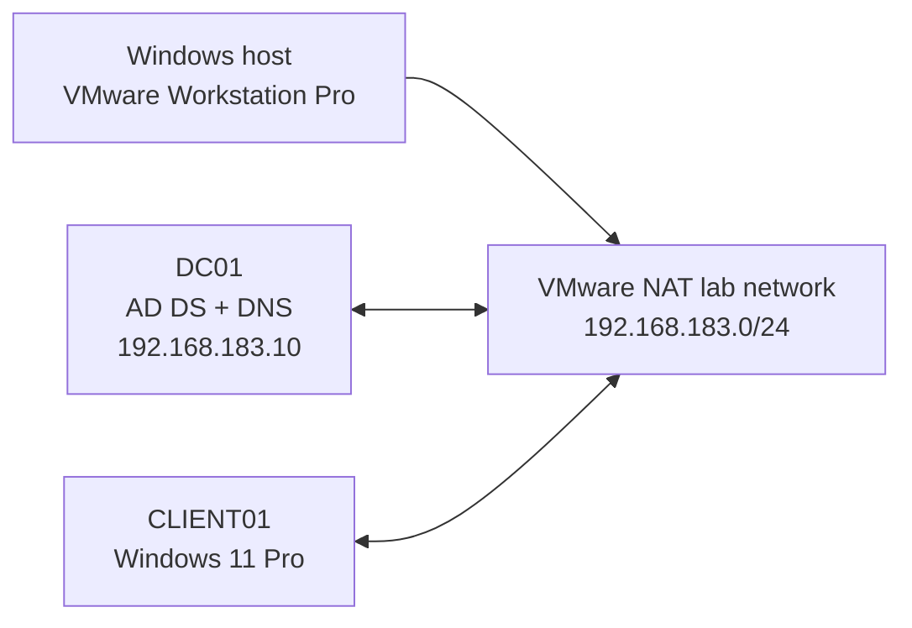

# Active Directory Domain Services Home Lab

## Project overview

This repository presents a practical Microsoft Active Directory Domain Services
(AD DS) home lab built with VMware Workstation Pro, Windows Server 2022, and
Windows 11 Pro.

The lab models a fictional organization named **Northstar Technologies** and
documents the deployment, configuration, testing, and troubleshooting of a
small Windows domain. Its purpose is to demonstrate hands-on ability in Windows
Server administration, identity and access management, DNS, Group Policy, and
technical documentation.

> **Current milestone:** `DC01` is operating as the domain controller and DNS
> server for `northstar.example.com`. `CLIENT01` has been joined to the domain,
> removed safely, manually prestaged in a Workstations organizational unit,
> rejoined, and used to validate domain authentication and the first user-based
> Group Policy Object.

## Lab environment

| System | Hostname | Role | Operating system |
|---|---|---|---|
| Domain controller | `DC01` | AD DS, DNS and Group Policy management | Windows Server 2022 Standard Evaluation |
| Client workstation | `CLIENT01` | Domain-joined endpoint | Windows 11 Pro 25H2 |
| Hypervisor | — | Virtualization platform | VMware Workstation Pro |

| Network setting | Value |
|---|---|
| AD forest and DNS domain | `northstar.example.com` |
| NetBIOS domain | `NORTHSTAR` |
| VMware network | NAT, `192.168.183.0/24` |
| Domain controller address | `192.168.183.10` |
| Default gateway | `192.168.183.2` |
| Client DNS server | `192.168.183.10` |

## Architecture

## Work completed

- Assessed host capacity and designed the virtual lab.
- Deployed Windows Server 2022 with Desktop Experience.
- Installed VMware Tools and created recovery snapshots.
- Renamed and prepared `DC01` with static IPv4 addressing.
- Installed AD DS and DNS and created the `northstar.example.com` forest.
- Validated AD-integrated DNS zones and domain-controller locator records.
- Created organizational units, a domain user, and a computer account.
- Joined `CLIENT01` and verified domain-user authentication.
- Practised the computer-account lifecycle by removing and rejoining the client.
- Observed and removed a stale computer object.
- Manually prestaged `CLIENT01` in the Workstations OU.
- Created and linked the first user-based GPO.
- Configured a Control Panel and Settings restriction.
- Refreshed Group Policy with `gpupdate /force` and tested the result.
- Recorded validation evidence, troubleshooting decisions, and lessons learned.

## Key concepts demonstrated

- Active Directory forests, domains and domain controllers
- DNS dependency and domain-controller discovery
- Organizational-unit design
- User and computer account management
- Local accounts versus domain accounts
- Computer-account prestaging and secure-channel establishment
- Group Policy creation, linking, scope and client-side processing
- Static IPv4 configuration in a VMware NAT environment
- Recovery snapshots and controlled rollback
- PowerShell-assisted verification
- Evidence-based troubleshooting and technical documentation

## Documentation package

Download the complete GitHub-ready project:

**[Download the AD DS VMware lab documentation](ad-ds-vmware-lab-starter.zip)**

The ZIP contains:

- detailed lab guides from planning through the first GPO;
- architecture and design decisions;
- sanitized screenshots;
- validation and troubleshooting records;
- scripts used for repeatable checks;
- interview-ready explanations; and
- a project changelog.

The virtual machines, ISO images, passwords, recovery secrets, and private
personal study guide are intentionally excluded.

## Implementation roadmap

| Phase | Deliverable | Status |
|---:|---|---|
| 0 | Planning, prerequisites and recovery snapshot | Complete |
| 1 | Windows Server virtual-machine deployment | Complete |
| 2 | Server preparation, networking and static addressing | Complete |
| 3 | AD DS installation and forest creation | Complete |
| 4 | Client domain join and first domain-user login | Complete |
| 5 | OU, user, computer and group administration | In progress |
| 6 | Group Policy configuration | In progress — first user GPO validated |
| 7 | File shares and access control | Planned |
| 8 | Second domain controller and replication | Planned |
| 9 | Troubleshooting scenarios and final validation | Planned |

## Validation highlights

The following outcomes have been validated:

- `DC01` uses the intended hostname and static address.
- AD DS, DNS, Kerberos, Netlogon and NTDS services are installed and running.
- `northstar.example.com` and `_msdcs.northstar.example.com` are
  AD-integrated DNS zones.
- Domain-controller locator records resolve to `DC01`.
- The server network profile is `DomainAuthenticated`.
- `CLIENT01` can establish a secure channel with the domain.
- The computer account appears enabled in Active Directory Users and Computers.
- A Northstar domain user can authenticate on `CLIENT01`.
- The prestaged computer account can be reused during a domain rejoin.
- The first user GPO reaches its intended client and user scope.

## Troubleshooting example

After the first domain-controller promotion, DNS zones and records did not
appear correctly and the network remained on the Public profile. The lab was
restored from a clean recovery snapshot and the promotion was repeated using
the corrected forest name. The client and domain controller were configured to
use the domain controller as their DNS server. Cycling the network adapter
caused Windows Network Location Awareness to rediscover the domain and change
the profile to `DomainAuthenticated`.

This exercise reinforced that Active Directory relies on DNS to locate domain
services and that snapshots provide a controlled recovery point during major
infrastructure changes.

## Security and privacy

- This is an isolated educational environment, not a production deployment.
- All organization and identity information is fictional.
- No passwords, DSRM secrets, product keys or personal identifiers are stored.
- Screenshots are reviewed before publication.
- Virtual disks, ISO images and other large or licensed files are excluded.

## Author

**Muhammad Muneef Sajid**  
Information Technology Graduate

## References

- [Microsoft Learn — Active Directory Domain Services overview](https://learn.microsoft.com/en-us/windows-server/identity/ad-ds/get-started/virtual-dc/active-directory-domain-services-overview)
- [Microsoft Learn — Install Active Directory Domain Services](https://learn.microsoft.com/en-us/windows-server/identity/ad-ds/deploy/install-active-directory-domain-services--level-100-)
- [Microsoft Learn — Group Policy overview](https://learn.microsoft.com/en-us/previous-versions/windows/desktop/policy/group-policy-overview)
- [Microsoft Learn — Windows 11 release information](https://learn.microsoft.com/en-us/windows/release-health/windows11-release-information)
- [Broadcom documentation — VMware Workstation Pro networking](https://techdocs.broadcom.com/us/en/vmware-cis/desktop-hypervisors/workstation-pro/17-0/using-vmware-workstation-pro/configuring-network-connections.html)
