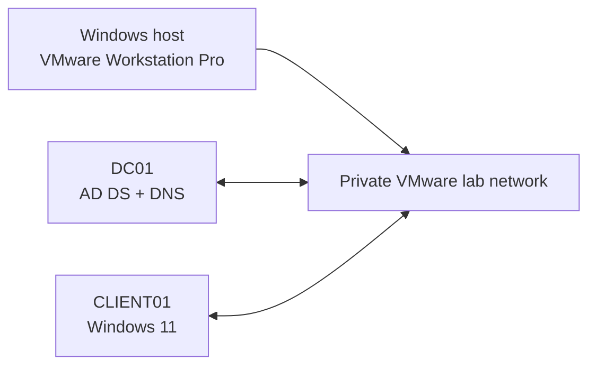

# Active Directory Domain Services Home Lab

## Project overview

This project documents the completed design and implementation of a virtualized Microsoft Active Directory Domain Services (AD DS) environment. The lab was built in VMware Workstation Pro to demonstrate practical skills in Windows Server administration, identity management, DNS, Group Policy, access control, troubleshooting, and technical documentation.

The environment represents a fictional company named **Northstar Technologies**. All names, addresses, users, and credentials used in the project are fictional.

> **Project status: Complete.** `DC01` is a healthy domain controller for `northstar.example.com`. `CLIENT01` is domain joined; identity and account-lifecycle administration, Group Policy processing, and IT/HR access through AGDLP have been validated. The domain password and account-lockout baseline is configured and protected by a GPO backup. The completed scope intentionally uses one domain controller.

## Project objectives

- Deploy Windows Server 2022 as a virtual machine.
- Configure a safe, isolated VMware lab network.
- Install AD DS and create a new forest.
- Configure integrated DNS services.
- Join a Windows 11 client to the domain.
- Design organizational units for users, groups, computers, and administrators.
- Create role-based security groups.
- Implement account provisioning and deprovisioning workflows.
- Apply and troubleshoot Group Policy Objects.
- Configure file-sharing and NTFS permissions.
- Document testing, failures, resolutions, and lessons learned.

## Lab environment

| System | Hostname | Role | Operating system |
|---|---|---|---|
| Domain controller | `DC01` | AD DS, DNS | Windows Server 2022 with Desktop Experience |
| Client workstation | `CLIENT01` | Domain-joined endpoint | Windows 11 Pro 25H2 |
| VMware host | Not documented publicly | Hypervisor host | Windows |

The lab uses the `northstar.example.com` forest on VMware NAT network `192.168.183.0/24`. `DC01` has static address `192.168.183.10`.

## Architecture

## Implementation roadmap

| Phase | Deliverable | Status |
|---:|---|---|
| 0 | Prerequisite assessment and recovery snapshot | Complete |
| 1 | Windows Server VM deployment | Complete |
| 2 | VMware networking and static addressing | Complete |
| 3 | AD DS installation and forest creation | Complete |
| 4 | Client domain join and first user login | Complete |
| 5 | OU, user, computer, and group administration | Complete |
| 6 | Group Policy configuration | Complete - user restriction validated and rolled back |
| 7 | File shares and access control | Complete - IT Modify and HR Read validated |
| 8 | Domain password and account-lockout policy | Complete - baseline configured and GPO backed up |

## Skills demonstrated

- VMware virtual-machine administration
- Windows Server deployment
- Active Directory Domain Services
- DNS and service discovery
- User and computer account management
- Security-group design
- Organizational-unit design and delegation
- Group Policy administration
- NTFS and share permissions
- PowerShell fundamentals
- Testing and technical troubleshooting
- Change documentation

## Documentation

- [Lab 00 - Planning and prerequisites](docs/00-planning-and-prerequisites.md)
- [Lab 01 - Deploying the Windows Server 2022 VM](docs/01-windows-server-vm-deployment.md)
- [Lab 02 - Preparing DC01](docs/02-domain-controller-preparation.md)
- [Lab 03 - Installing AD DS and creating the forest](docs/03-ad-ds-forest-deployment.md)
- [Lab 04 - Joining CLIENT01 and testing a domain user](docs/04-client-domain-join-and-first-user.md)
- [Lab 05 - Computer lifecycle and first Group Policy](docs/05-computer-lifecycle-and-first-gpo.md)
- [Lab 06 - Identity, groups, and Group Policy validation](docs/06-identity-groups-and-gpo-validation.md)
- [Lab 07 - SMB file shares and AGDLP authorization](docs/07-file-shares-and-agdlp.md)
- [Lab 08 - Domain password and account-lockout policy](docs/08-domain-password-and-lockout-policy.md)
- [Architecture and design decisions](docs/architecture.md)
- [Validation checklist](docs/validation-checklist.md)
- [Troubleshooting log](docs/troubleshooting-log.md)
- [Screenshot standards](docs/screenshot-standards.md)
- [Project changelog](CHANGELOG.md)

The documented phases represent the completed scope of this portfolio lab. A second domain controller is intentionally excluded from the current design.

## Security and privacy

- This is an isolated educational environment, not a production deployment.
- Lab passwords and recovery secrets are never committed.
- Screenshots are reviewed and sanitized before publication.
- Personal hostnames, email addresses, IP addresses, license keys, and unrelated applications are excluded.
- Placeholder accounts and fictional employee information are used throughout the project.

## References

- [Microsoft Learn: Active Directory Domain Services overview](https://learn.microsoft.com/en-us/windows-server/identity/ad-ds/get-started/virtual-dc/active-directory-domain-services-overview)
- [Microsoft Learn: Install Active Directory Domain Services](https://learn.microsoft.com/en-us/windows-server/identity/ad-ds/deploy/install-active-directory-domain-services--level-100-)
- [Microsoft Evaluation Center: Windows Server 2022](https://www.microsoft.com/en-us/evalcenter/evaluate-windows-server-2022)
- [Broadcom: Configuring host-only networking in VMware Workstation Pro](https://techdocs.broadcom.com/us/en/vmware-cis/desktop-hypervisors/workstation-pro/17-0/using-vmware-workstation-pro/configuring-network-connections/configuring-host-only-networking.html)

## Author

**Muhammad Muneef Sajid**  
Information Technology Graduate
